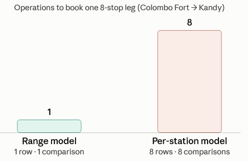

# Train Seat Booking

## Running the project

### Docker — one command (recommended)

Prerequisites: Docker Desktop (or Docker Engine + Compose). Both `docker
compose up` and the older hyphenated `docker-compose up` work — they read
the same `docker-compose.yml`.

```bash
docker-compose up --build
```

Once it's up, open **http://localhost:5173** and book a seat.

To stop everything:

```bash
docker-compose down
```

### Local (without Docker)

Prerequisites: Node.js 18+, a [Supabase](https://supabase.com) account (or
any reachable Postgres 14+ with the `btree_gist` extension available).

1. **Create a Supabase project** (free tier is fine), or point at your own
   Postgres instance.
2. **Enable the extension** — in the Supabase SQL editor (or via `psql`),
   run:
   ```sql
   CREATE EXTENSION IF NOT EXISTS btree_gist;
   ```
   (The migration also runs this itself, so this is really just a
   convenience/sanity check.)
3. **Get the connection string** — in Supabase: Project Settings →
   Database → Connection string → **URI**. Use the **direct connection
   (port 5432)**, not the Supavisor pooler (port 6543), for running
   migrations.
4. **Backend:**
   ```bash
   cd backend
   cp .env.example .env
   # edit .env and set DATABASE_URL to your connection string
   npm install
   npm run migrate
   npm run seed
   npm run dev
   ```
   The API starts on `http://localhost:4000` (configurable via `PORT` in
   `.env`). If `DATABASE_URL` isn't set, the server fails immediately with
   a clear error instead of defaulting to anything.
5. **Frontend** (separate terminal):
   ```bash
   cd frontend
   cp .env.example .env
   # edit .env if the backend isn't running on the default URL
   npm install
   npm run dev
   ```
   Opens on `http://localhost:5173` by default.
6. Open the frontend, pick a date/leg/train, and book a seat.

`npm run migrate` and `npm run seed` are both safe to re-run — migrations
are tracked in their own table, and the seed script checks what already
exists before writing anything.


## Design decisions and reasoning
 
### Data model: half-open intervals, not per-station flags

In this system seat occupancy is modeled as a range `[origin_seq, destination_seq)` over a
trip's stop sequence, rather than a boolean per station the seat passes
through. A passenger going Colombo Fort → Kandy occupies the seat for
`[0, 8)`; a later passenger going Kandy → Badulla occupies `[8, 19)`. These
don't overlap, so both bookings can stand on the same seat without any issue.
 
The alternative — a row per seat per station, flipped to "occupied" for
every station the passenger passes — works but turns every booking and
every availability check into an operation over N station-rows instead of
one range comparison, and turns overlap detection into application code
that has to reason about a set of flags instead of letting the database
compare two intervals directly. Ranges also compose naturally with
Postgres's built-in range types and GiST indexing (below), which per-station
flags don't.
 
`sequence` (not distance or time) is the unit ranges are expressed in,
because it's what "overlap" actually means here: two legs conflict iff
they share a stop, regardless of the distance or time between stops.

| | Range model (`[origin_seq, dest_seq)`) | Per-station flags |
|---|---|---|
| **Rows per booking** | 1 | One per station passed (8–19) |
| **Overlap check** | 1 range comparison | Loop over every shared station |
| **Who enforces it** | Postgres `EXCLUDE` + GiST index | Application code you write |
| **Race-condition safety** | Guaranteed by the DB constraint | Depends on your locking logic |
| **Adjacent bookings (e.g. both "touch" Kandy)** | Handled natively via half-open intervals | Must hand-code the arrival-vs-departure rule |
| **Failure mode on partial write** | Single INSERT, atomic | Multi-row batch can fail halfway through |
| **Scales with trip length** | Constant (1 row regardless of stops) | Grows linearly with number of stops |




## Repo layout

```
.
├── docker-compose.yml          Local Postgres + migrate/seed (one-shot) + backend + frontend
├── .env.example                Optional DATABASE_URL override for docker-compose (point at real Supabase)
├── package.json                Root scripts: npm run test:concurrency
│
├── backend/                    Express API (TypeScript, hand-written SQL via pg)
│   ├── Dockerfile              Single image, reused for migrate/seed/serve via command override
│   ├── .dockerignore
│   ├── .env.example            DATABASE_URL, PORT, CORS_ORIGIN, HOLD_DURATION_MINUTES, SWEEPER_INTERVAL_SECONDS
│   ├── package.json            Scripts
│   ├── tsconfig.json
│   ├── migrations/             node-pg-migrate migration files (raw SQL, no ORM)
│   │   ├── 1706000000000_init.cjs                  Core schema: station/route/trip/coach/seat/booking + EXCLUDE constraint
│   │   └── 1706000100000_add_scheduled_times.cjs   Adds route_station.offset_minutes, trip_stop.scheduled_arrival/departure
│   ├── scripts/
│   │   └── seed.ts             Database population script : stations, route, trains, coaches/seats, fare rules, trips
│   └── src/
│       ├── server.ts           Express app wiring, error middleware, starts the sweeper
│       ├── config.ts           Env-driven config (port, CORS origin, hold duration, sweeper interval)
│       ├── db.ts                Pool setup, withTransaction() helper, DATABASE_URL fail-fast check
│       ├── errors.ts           AppError + PG_EXCLUSION_VIOLATION (23P01) helpers
│       ├── sweeper.ts          Background job that cancels globally expired 'held' bookings
│       ├── routes/
│       │   ├── stations.ts     GET /api/routes, GET /api/routes/:routeId/stations
│       │   ├── trips.ts        GET /api/trips (date/leg-filtered), GET /api/trips/:id, GET .../availability
│       │   ├── bookings.ts     POST /api/bookings, POST .../confirm, DELETE /api/bookings/:id, GET /api/bookings/:id
│       │   └── passengers.ts   POST /api/passengers
│       └── services/
│           └── bookings.ts     Transactional booking logic: lazy sweep, fare calc, 23P01 -> 409 translation
│
├── frontend/                   React + TypeScript + Vite
│   ├── Dockerfile               Multi-stage: vite build -> nginx serving the static bundle
│   ├── .dockerignore
│   ├── .env.example             VITE_API_URL
│   ├── package.json
│   ├── vite.config.ts
│   ├── index.html
│   └── src/
│       ├── main.tsx
│       ├── App.tsx              Top-level flow: date -> origin/destination -> train -> seat -> pay
│       ├── App.css              All app styles (filter bar, train list, seat map, bottom booking bar, modals)
│       ├── index.css            CSS reset + theme variables
│       ├── api.ts               Typed fetch client for the backend API
│       ├── time.ts              Sri Lanka-timezone-aware time/duration formatting helpers
│       └── components/
│           ├── StationPicker.tsx    Origin/destination <select> pair
│           ├── TimeRangePicker.tsx  Departs-after / departs-before filter
│           ├── TrainList.tsx        Clickable list of trains matching the current filters
│           ├── SeatMap.tsx          Coach tabs, legend, seat grid (per-coach availability)
│           ├── PassengerModal.tsx   Name + mobile number, then dummy OTP verification
│           ├── PassengerBadge.tsx   "Booking as X" indicator once a passenger is set
│           └── BookingPanel.tsx     Sticky bottom bar: held/confirmed summary, countdown, Pay Now
│
├── scripts/
│   └── concurrency-test.mjs    Black-box test: races two bookings for the same seat, asserts 201 + 409
│
├── docs/
│   └── DATABASE-SCHEMA.md      Full entity-by-entity schema reference and constraint rationale
│
└── .claude/
    └── launch.json             Dev-server config for the in-editor browser preview (not part of the app)
```

